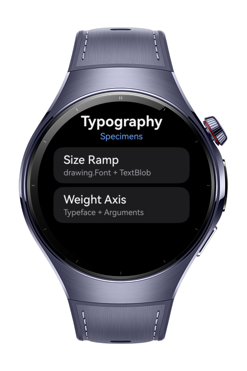
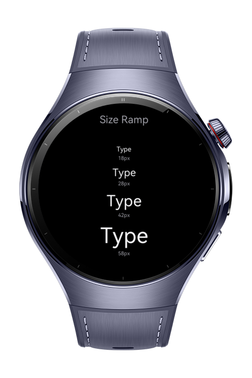
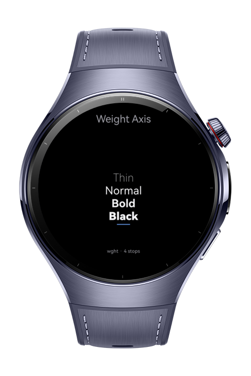
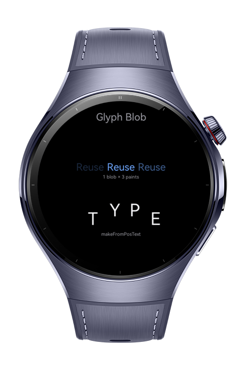

# How To Build Typography Showcase

**How To Build Typography Showcase** is a HarmonyOS wearable codelab that renders the same word across font sizes, weights, positioned glyph blobs, and a laid-out paragraph using the low-level ArkGraphics2D text APIs.

It demonstrates how `drawing.Font`, `drawing.TextBlob`, `drawing.Typeface`, `drawing.TypefaceArguments`, and the `text` module compose into a circular-display readability tool.

# Preview

<div align="center">
  
  
  
  
</div>

# Use Cases

- **Validate readability:** Compare the same word at four sizes on the round display to find the smallest legible size for a glanceable face.
- **Tune weight choices:** Walk a weight axis from Thin to Black with `text.ParagraphBuilder` to pick a weight that holds at watch distance.
- **Reuse positioned glyphs:** Build an immutable `drawing.TextBlob` once and redraw it for cheap repeated rendering, including custom per-glyph positions via `makeFromPosText`.
- **Lay out wrapped copy:** Compose a multi-style paragraph with the `text` module to test how long copy wraps inside the circular safe area.

# Tech Stack

- **Languages**: ArkTS, ArkUI
- **Frameworks**: HarmonyOS SDK 6.0.1 (API 21)
- **Tools**: DevEco Studio NEXT
- **Libraries**:
  - `@kit.ArkGraphics2D` (`drawing` module: `Canvas`, `Font`, `Typeface`, `TypefaceArguments`, `TextBlob`)
  - `@kit.ArkGraphics2D` (`text` module: `FontCollection`, `ParagraphBuilder`, `ParagraphStyle`, `TextStyle`)
  - `@kit.ArkUI` (`NodeContainer`, `NodeController`, `RenderNode`, `FrameNode`, `Navigation`, `NavPathStack`)

# Directory Structure

```text
entry/src/main/ets/
├── components/
│   └── SpecimenCanvas.ets         # NodeContainer + RenderNode drawing surface
├── constants/
│   └── SpecimenConfig.ets         # Specimen list, sample text, ARGB palette
├── entryability/
│   └── EntryAbility.ets
├── entrybackupability/
│   └── EntryBackupAbility.ets
├── model/
│   └── Specimen.ets               # SpecimenId and SpecimenItem types
├── pages/
│   └── Index.ets                  # Navigation host with NavPathStack route map
├── services/
│   ├── RendererUtils.ets          # Brush, color, background, centered blob helpers
│   ├── SizeRenderer.ets           # drawing.Font + TextBlob size ramp
│   ├── WeightRenderer.ets         # Typeface + TypefaceArguments weight axis
│   ├── BlobRenderer.ets           # TextBlob reuse + makeFromPosText glyphs
│   └── ParagraphRenderer.ets      # text.ParagraphBuilder layout
└── views/
    ├── HomeView.ets               # Specimen list, push routes
    ├── SizeView.ets               # Size ramp NavDestination
    ├── WeightView.ets             # Weight axis NavDestination
    ├── BlobView.ets               # Glyph blob NavDestination
    └── ParagraphView.ets          # Paragraph NavDestination
```

# Constraints and Restrictions

## Supported Devices

- Huawei Watch 5
- DevEco Studio Simulator

The renderers assume the round wearable safe area and an AMOLED black background. Font weight variations are most visible when the system default typeface is a variable font; on a non-variable fallback the weight ramp still renders but axis-driven differences may be minimal.

# License

**How To Build Typography Showcase** is distributed under the terms of the MIT License.
See the [LICENSE](/LICENSE) for more information.
